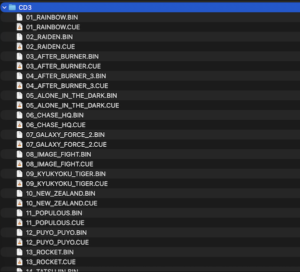
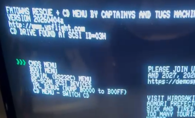
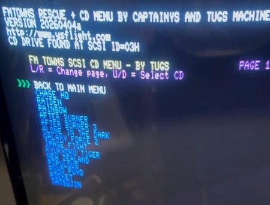

# FM Towns CD launcher aka "CD Menu" integrated into CaptainYS' Rescue IPL

A sub-menu added to CaptainYS' FM Towns Rescue IPL that lets the user list
and switch BlueSCSI CD images directly from the boot menu, with pagination,
name cleanup, colour highlighting of the active CD, and two action keys:
**Enter** (select + return to main menu) and **Space** (select + direct boot).

Check [PROJECT.md](PROJECT.md) for more information

## Some project's pictures

- Organization of files on CD3 directory (SDCard plugged to BlueSCSI v2)



- CD Menu entry added to CaptainYS' menu



- CD Menu : List of CDs and pagination



## What v1 adds on top of the release candidate

| Change | Status |
|---|---|
| **Boots directly to MAIN MENU** (no forced detour through BOOT MENU) | OK |
| **Pagination** — 14 CDs per page, left/right arrows switch pages | OK |
| **Page indicator** `PAGE X / Y` shown top-right when there is more than one page | OK |
| **Name cleanup** — `01_RAINBOW_ISLAND.BIN` → `RAINBOW ISLAND` | OK |
| **Game names in bright blue** (contrasts with BACK TO MAIN MENU in white) | OK |
| **Title in yellow**, errors in red, status messages in cyan | OK |
| **Navigation hints** on screen at all times | OK |
| **Currently-active CD in bright green** after selection (v5.3) | OK |
| **ENTER** key / pad A → select + return to main menu (v5.3) | OK |
| **SPACE** key / pad B → select + direct boot via `BOOT_FROM_SCSI_CD` (v5.4) | OK |

## Capacity

- 14 CDs per page × up to ~8 pages = **up to 100 CDs** (BlueSCSI Toolbox limit).
- With ~50 games you get **4 pages** (14 + 14 + 14 + 8).

## Two selection actions

| Input | Action |
|---|---|
| **ENTER** (keyboard) or **pad button A** | Switch the CD on BlueSCSI and return to the main menu. The selected CD will be highlighted in green on the next visit to CD MENU. |
| **SPACE** (keyboard) or **pad button B** | Switch the CD on BlueSCSI **and immediately boot it** via CaptainYS' `BOOT_FROM_SCSI_CD` routine (same code path the BOOT MENU uses). |

The green highlight for the currently-active CD persists across sub-menu
visits as long as the FM Towns is not power-cycled.

## Converting the BIN to HFE for the Gotek

1. Open **HxCFloppyEmulator** (`Load raw file...`) and pick `FDIMAGEM.BIN`.
2. **Important: set RPM to `360`** — FM Towns 1232 KB 2HD floppies spin at
   360 RPM, and the HFE metadata must match or the Gotek will not read the
   disk.
3. Geometry: **2HD 1232 KB**, 77 tracks × 2 sides × 8 sectors × 1024 bytes.
4. `Save as HFE` → e.g. `cdmenu.hfe`.
5. Copy the HFE onto the Gotek's USB stick.

## Name cleanup rules

The cleanup routine applies to each filename returned by `LIST_CDS`:

```
Input:  "01_RAINBOW_ISLAND.BIN"   (raw from LIST_CDS)
Step 1: if the name starts with digits followed by '_', skip that prefix
Step 2: copy characters until '.' (extension) or end of string
Step 3: replace '_' with ' '
Step 4: convert to UPPERCASE
Output: "RAINBOW ISLAND"
```

Examples:

| Raw filename             | Displayed as     |
|--------------------------|------------------|
| `01_RAINBOW_ISLAND.BIN`  | `RAINBOW ISLAND` |
| `02_RAIDEN.BIN`          | `RAIDEN`         |
| `TATSUJIN.BIN`           | `TATSUJIN`       |
| `12_AFTER_BURNER_3.BIN`  | `AFTER BURNER 3` |

Sort order follows the filesystem order returned by BlueSCSI. If you want a
specific ordering, prefix the files with `NN_` (the cleanup strips the
prefix before displaying, so it does not pollute the visible name).

## Expected on-screen layout

```
                    FMTOWNS RESCUE + CD MENU BY CAPTAINYS AND TUGS
                    VERSION 20260404a
                    http://www.ysflight.com
                    CD DRIVE FOUND AT SCSI ID=03H

    FM TOWNS SCSI CD MENU - BY TUGS                        PAGE 1 / 4
    L/R=Page  U/D=Select  ENTER=Pick  SPACE=Pick+Boot

 >>>  BACK TO MAIN MENU          (white)
      RAIDEN                     (blue, or GREEN if currently active)
      RAINBOW ISLAND             (blue)
      AFTER BURNER 3             (blue)
      CHASE HQ                   (blue)
      ... up to 14 games per page ...
```

## Navigation

| Key / Pad         | Action                                          |
|-------------------|-------------------------------------------------|
| Up / Down         | Move the cursor within the current page         |
| Left / Right      | Change page (wraps around)                      |
| **ENTER** / pad A | Select the CD and return to main menu           |
| **SPACE** / pad B | Select the CD and directly boot it              |

## Files in this directory

| File | Purpose |
|---|---|
| **`FDIMAGEM.BIN`** | 1232 KB 2HD disk image ready to convert to HFE |
| `LOADER.BIN`       | Loader only (for debugging) |
| `CDSWMENU.ASM`     | Source of the new sub-menu |
| `MAINMENU.ASM`     | Patched MAINMENU (new CD MENU entry + removed `CALL BOOTMENU` on startup) |
| `LOADER.ASM`       | Patched LOADER (new splash text + `INCLUDE CDSWMENU.ASM`) |
| `PROJECT.md`       | Full project documentation (BlueSCSI concepts, build instructions, credits) |
| `README.md`        | This file |
| `make_fdimage.py   | A small python program to create the .BIN image (needs to be converted to HFE for Gotek) |

## Important notes

1. **14 items per page** is tuned to fit the 640×480 FM Towns screen with
   the header, title, nav hints and footer visible. Tune
   `CDSWMENU_ITEMS_PER_PAGE` in `CDSWMENU.ASM` if you want a different
   layout.

2. **Colours** use the FM Towns 16-colour palette:
   - Title: 14 (yellow)
   - `BACK TO MAIN MENU`: 15 (white)
   - Unselected CDs: 9 (bright blue)
   - Currently-active CD: 10 (bright green)
   - Status / nav hints: 11 (cyan)
   - Errors: 12 (bright red)

3. **Alphabetical sort is not implemented**. The display order follows the
   filesystem order returned by BlueSCSI. Use `NN_` prefixes on filenames
   if you need a specific order (the prefixes are stripped on display).

4. **No intra-page scrolling**. Inside a page the cursor wraps via
   CaptainYS' `MOVE_ARROW_BY_PAD`, exactly like every other CaptainYS
   sub-menu.

## Recommended test path

1. Boot from the new HFE.
2. Check that the splash line reads
   `FMTOWNS RESCUE + CD MENU BY CAPTAINYS AND TUGS`
   and that the boot lands on the **main menu** (six entries, including
   `CD MENU - SWITCH CD`).
3. Enter `CD MENU - SWITCH CD`. Verify that:
   - The title is yellow.
   - `BACK TO MAIN MENU` is white.
   - Game names are blue and cleanly stripped of `NN_` / `.BIN`.
   - Nav hints are cyan along the top, below the title.
   - `PAGE 1 / N` appears top-right if there are two or more pages.
4. Test the input mapping:
   - Up / Down moves the cursor.
   - Left / Right changes pages (when ≥ 2 pages).
   - **ENTER** on a game → `CD SWITCHED` message, back to main menu.
   - Go back into CD MENU — the selected CD is now green.
   - **SPACE** on a game → `BOOTING SELECTED CD...` → the game boots
     straight away without going through BOOT MENU.
5. From the main menu, the BOOT MENU still works exactly as before and can
   be used as an alternative boot path.
